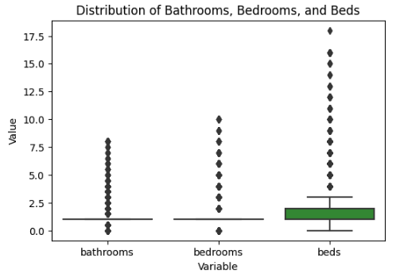
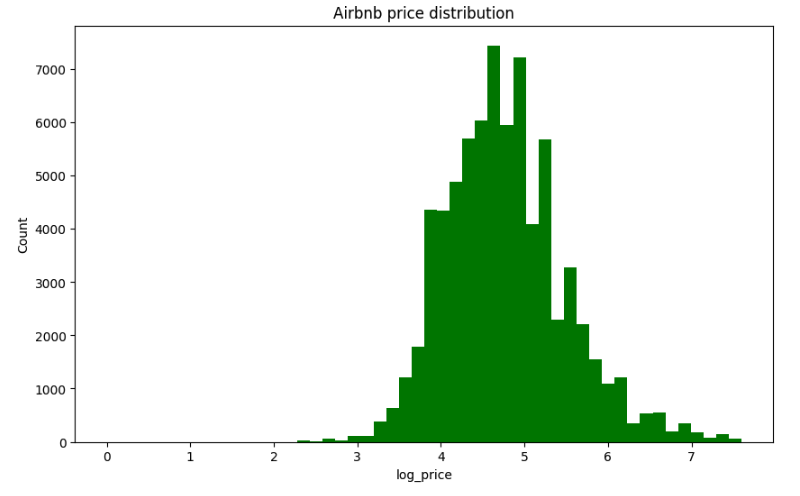
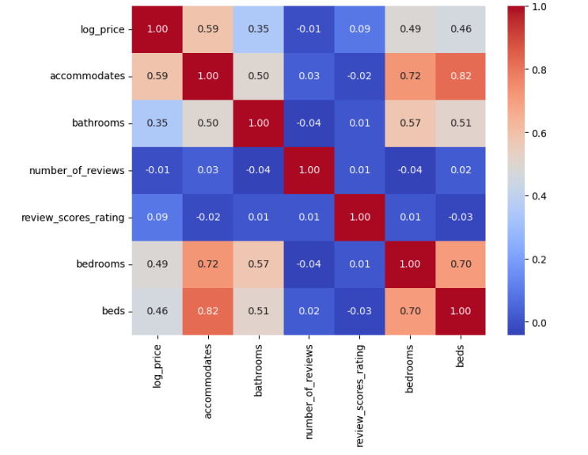
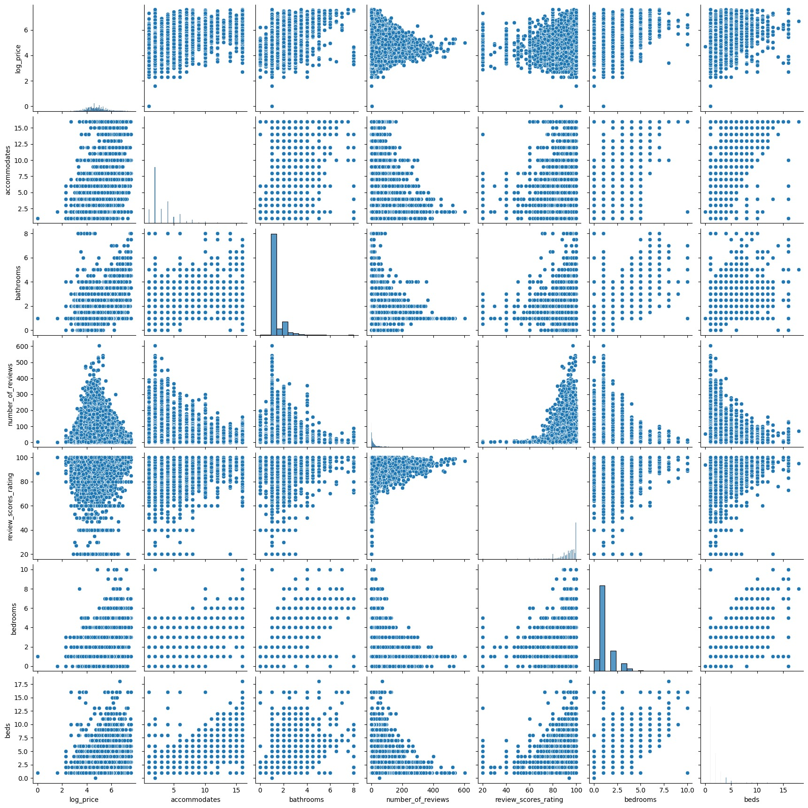
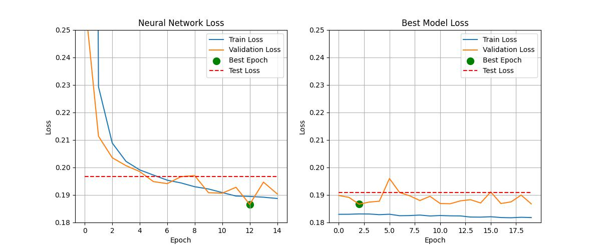
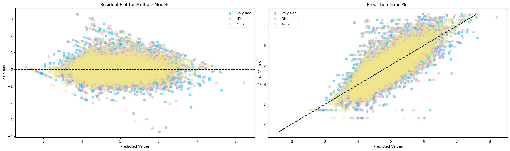
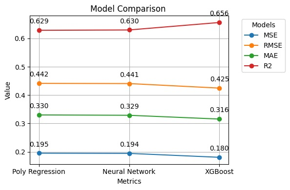

# Advanced Forecasting for Airbnb Competitive Rental Pricing

## Introduction
The project focuses on developing a predictive model for rental prices in various cities, using data such as property type, room type, and other relevant features. This endeavor was chosen due to its potential to offer valuable insights into the rental market, enabling both renters and landlords to make informed decisions. 

For renters, it demystifies the rental pricing landscape, aiding them in finding accommodations that fit their budget and preferences. Landlords, on the other hand, can optimize their pricing strategies to remain competitive while ensuring profitability. Furthermore, this model can contribute to a more transparent and efficient rental market, potentially influencing policy-making and urban planning by providing data-driven insights into housing trends. 

## Dataset
The dataset contains 74,111 listings, each with 29 attributes detailing the property, host, and booking policies, focused on predicting the logarithm of the renting price.
It can be retrieved from Kaggle at: [Kaggle Dataset](https://www.kaggle.com/datasets/rupindersinghrana/airbnb-price-dataset/data).

## Method

### Data Observation

1. The boxplot reveals the presence of outliers, makes the median a more reliable measure than the mean for imputing missing values.
<div style="display: flex; justify-content: center;" align="center">
  
</div>

2. The histogram of the distribution of Airbnb price shows the data is a little left-skewed, so we might choose some machine learning models are more robust to skewness like Random Forests or Gradient Boosting Machines.
<div style="display: flex; justify-content: center;" align="center">
  
</div>

3. The correlation matrix and pairplot is calculated below.
<div style="display: flex; justify-content: center;" align="center">
  
  
</div>

***More investigations of other attributes can be found in the [Data PreProcessing Notebook](Data_preprocessing.ipynb), which are not shown due to the limit of space.***

### Data Preprocessing

1. Data Cleaning: 
   1. We drop columns with excessive unique categories or missing data that would be impractical to one-hot encode or impute, such as 'thumbnail_url', 'zipcode', 'neighbourhood', 'first_review', and 'last_review'.
   2. We convert the id column to a numeric type and rename it to 'id' for clarity and ease of reference.

2. Handling Missing Values: 
   1. Based on the presence of outliers, median values are chosen as a more reliable measure for imputing missing values. Missing values in 'bathrooms', 'bedrooms', and 'beds' are imputed with the median of each column, grouped by the 'accommodates' category, to maintain the integrity of the data.
   2. Missing values in 'host_response_rate' and 'review_scores_rating' are imputed with their respective median values. Before imputation, the 'host_response_rate' is converted from a percentage string to a float.
   3. We drop latitude and longitude column because it is difficult to process this kind of data and we already have City column.

3. Bag of Words (BOW) & Term Frequency-Inverse Document Frequency(TF-IDF)
   1. To utilize the 'description' and 'name' feature in training, we first need to transform each description into a vector and then discover the relationship between the descriptions and the log price. We use BOW and TF-IDF techniques, respectively, during the transformation process. We initially train the transformed vectors with the log price using a linear regression model, so that the model's theta learns the potential relationship between the description vector and the log price. We extract the theta of the LR model based on the words in each description. Then, we sum up the values of the corresponding theta and append the result as a new feature to our final training set.

4. Sentiment
   1.  It calculates the sentiment scores for the description and the name of a datapoint by summing up the sentiment scores of each word in the cleaned 'description' and 'name' respectively. If a word is not found in the sentiment_dict, its sentiment score is considered as 0.
         ```python
         punctuation = set(string.punctuation)

         def sentiment(d):
            sentimentScore = 0
            r = ''.join([c for c in d.lower() if not c in punctuation])
            for w in r.split():
               sentimentScore += sentiment_dict.get(w, 0)
            return sentimentScore
         def name(d):
            sentimentScore = 0
            r = ''.join([c for c in d.lower() if not c in punctuation])
            for w in r.split():
               sentimentScore += name_dict.get(w, 0)
            return sentimentScore
         ```

5. Fix perfect multicollinearity(not incorporated into our model)
   1. Perfect multicollinearity happens when one variable can be perfectly predicted from the others, causing issues in regression models by inflating the variance of the coefficient estimates, which can lead to a very large MSE. By setting drop_first=True, the function will drop the first level for each categorical variable. This effectively removes one dummy variable from each set of dummies derived from a categorical variable, thus eliminating the perfect multicollinearity that occurs when all dummy variables for a category are included.
      ```python
      df_encoded = pd.get_dummies(df, columns=['cleaning_fee','host_has_profile_pic', 'host_identity_verified', 'instant_bookable'], drop_first=True)
      ```

6. Encoding
   1. One-Hot Encoding(not incorporated into our model):
      1. Categorical variables such as 'property_type', 'room_type', 'bed_type', 'cancellation_policy', 'city', 'cleaning_fee', 'host_has_profile_pic', 'host_identity_verified', and 'instant_bookable' were initially one-hot encoded. This process transforms categorical variables into a format that can be used in machine learning algorithms, creating separate binary columns for each category.
   2. KFold Target encoding:
      1. Due to the high dimensionality encountered with one-hot encoding, we implemented K-Fold target encoding to mitigate the issue and **we will use this encoding method to evaluate our models**. Target encoding is especially beneficial for neural network models. Where categorical features are replaced with the mean value of a target variable ('log_price') computed from each fold of the training data, to prevent data leakage.
   3. Leave One Out (LOO):
      1. Leave-One-Out (LOO) encoding is a form of target encoding that reduces overfitting by excluding the target value of the current row when calculating the category's mean target, thereby offering a more generalizable feature representation.
      <!-- 2. We tried LOO after target encoding, but obtained a MSE of 0.003 with our final model, which was dramastically lower than the prior MSE. We attemptted to find the reason that caused the reduction of the MSE but failed. Therefore, we decided not to ultilize this encoding technique until we find the reason. -->
   
7. Norm & Standard

We decided to use both standardization and normalization in our project. Standardization is great at handling the outliers we found in our data, which could really mess up our results if ignored. By combining both methods, we get the best of both worlds: easy-to-understand data from normalization and outlier resistance from standardization, making our data prep more effective and reliable.


### Model 1: 2nd degree Polynomial Regression
- Second-degree polynomial regression extends linear regression by modeling the relationship between the independent variable $x$ and the dependent variable $y$ as a quadratic equation of the form $y = ax^2 + bx + c$. This allows for capturing non-linear relationships between the variables, making it suitable for datasets where the trend bends or curves, rather than following a straight line.
   ```python
   degree=2
   model = make_pipeline(PolynomialFeatures(degree), LinearRegression())
   model.fit(X_train, y_train)
   y_val_pred = model.predict(X_val)
   y_test_pred = model.predict(X_test)
   ```

### Model 2: Deep Neural Network (DNN)
- We build our second model with DNN, and train with hyperparameter tuner. 
   ```python
   def build_hp_model(hp):
      model = Sequential()
      # Iterate over the number of layers
      for i in range(hp.Int('num_layers', 2, 6)):
         model.add(Dense(units=hp.Int('units_' + str(i), min_value=16, max_value=96, step=16),
                           activation=hp.Choice('activation_' + str(i), ['leaky_relu'])))
      
      model.add(Dense(1))  # Output layer for regression
      learning_rate = hp.Float('learning_rate', min_value=1e-4, max_value=1e-2, sampling='LOG')
      
      model.compile(optimizer=keras.optimizers.legacy.Adam(learning_rate=learning_rate),
                     loss='mean_squared_error',
                     metrics=['mean_squared_error'])
      return model
   
   tuner = keras_tuner.RandomSearch(
    hypermodel=build_hp_model,
    objective='val_loss',
    max_trials=8,
    seed=10,
    executions_per_trial=3,
    directory='tuner_results',
    project_name='keras_tuner_demo',
    overwrite=True
   )
   ```
- Two Keras callbacks are utilized to enhance the training process:

  - Early Stopping: Monitors the validation loss and stops training if there hasn't been a significant decrease (less than 0.001) in the validation loss for 5 consecutive epochs. This prevents overfitting and ensures the model restores the weights from the epoch with the best performance.
      ```
      early_stopping = keras.callbacks.EarlyStopping(
         monitor='val_loss',
         min_delta=0.001,
         patience=5,
         mode='min',
         restore_best_weights=True,
      )
      ```

  - Model Checkpoint: Saves the model at the filepath 'checkpoints' whenever a lower validation loss is observed. This ensures that the model configuration with the best validation performance is preserved, even if the model's performance degrades in subsequent epochs.
      ```
      model_checkpoint = keras.callbacks.ModelCheckpoint(
         filepath='best_model.h5',
         monitor='val_loss',
         save_best_only=True,
         save_weights_only= False,
         mode='min'
      )
      ```

<div style="display: flex; justify-content: center;" align="center">
  
</div>
The two graphs describe the progression of loss metrics over successive epochs for a baseline neural network model and an hyperparameter tuned version. Each graph tracks how the loss on the training, validation, and test data sets evolves with each epoch. The green dot identifies the epoch at which the validation loss is minimized, suggesting the most effective model prior to any overfitting.

### Model 3: Extreme Gradient Boosting (XGBoost)
- We build our third model with XGBoost.
- This model employs the XGBoost framework to optimize a regression task, using a `GridSearchCV` to fine-tune hyperparameters over a specified grid. The key parameters include tree depth, learning rate, subsample rate, and feature sampling rate. The `XGBRegressor` is configured to minimize squared error with early stopping to prevent overfitting. The grid search explores combinations of these hyperparameters across a training dataset, evaluating performance through cross-validation to select the best model based on the negative mean squared error.
  
   ```python
   param_grid = {
   'max_depth': [3, 4, 5, 6, 7],
   'eta': [0.01, 0.05, 0.1, 0.2],
   'subsample': [0.6, 0.7, 0.8, 0.9],
   'colsample_bytree': [0.6, 0.7, 0.8, 0.9],
   }
   xgb_model = xgb.XGBRegressor(n_estimators=250, random_state=42,objective='reg:squarederror', eval_metric='rmse',early_stopping_rounds=10)

   grid_search = GridSearchCV(estimator=xgb_model, param_grid=param_grid, cv=5, scoring='neg_mean_squared_error', verbose=False, n_jobs=-1)

   grid_search.fit(X_train_full, y_train_full, eval_set=[(X_val, y_val)], verbose=False)
   ```


## Result
- To evaluate our model, we utilized several metrics: 
  - Mean Squared Error (MSE) is favored for its emphasis on large errors
  - Mean Absolute Error (MAE) for its robustness to outliers and interpretability
  - Root Mean Squared Error (RMSE) for error representation in the target's units,
  - R-squared for indicating the model’s explanatory power in terms of the variance in the dependent variable it can predict. 
- Each metric provides unique insights, helping us understand different aspects of the model's performance.


The image showcases two types of plots(Residual Plot and Prediction Error Plot), each representing model evaluation for three different machine learning models: Polynomial Regression (Poly Reg), Neural Network (NN), and XGBoost (XGB).
<div style="display: flex; justify-content: center;" align="center">
  
</div>

The image showcases two types of plots, each representing model evaluation for three different machine learning models: Polynomial Regression (Poly Reg), Neural Network (NN), and XGBoost (XGB).

The spread of data points indicates that all three models have errors that increase as the predicted values get higher, which could suggest a systematic bias in model predictions for higher values. There's no clear distinction between the models in terms of performance from these plots alone. They appear to perform similarly across the range of values. Maybe the data points with  yellow are a bit more concentrated, this bunching might hint that the XGBoost is doing a tad better at predictions compare to other two. 


<div style="display: flex; justify-content: center;" align="center">
  
</div>


add descriptions

## Discussion
- In the discussion of our analytical approach, we started with the selection of a polynomial regression model, which was primarily driven by its lower mean squared error (MSE) compared to a linear model. This indicated a better fit to the data, aligning closely with the observed trends in our visualizations. However, we acknowledged that a more complex model isn't necessarily superior; it could be more prone to overfitting, especially if the polynomial degree was too high.

- We implemented k-fold cross-validation and neural network (NN) models to further refine our predictions and assess model stability across different data partitions. The inclusion of cross-validation was a critical step to guard against overfitting and to evaluate the model's ability to generalize to unseen data. With NN, we explored the utility of a more flexible, non-linear approach that could capture complex patterns in the data.

- Hyperparameter tuning was another vital step in the process, particularly for the NN model, where we ultimately selected the ReLU activation function. This decision was based on ReLU's performance and its widespread success in various applications, but we remained cautious about its well-known limitations, such as the dying ReLU problem.

- The final piece of our modeling puzzle was the XGBoost (XGB) algorithm, which brought an ensemble learning approach to the table. Its gradient boosting framework was expected to further enhance performance and has been celebrated for its effectiveness across numerous machine learning competitions.

- Throughout the process, we remained critical of our models, questioning their interpretability, especially with more complex architectures like NN and XGB. While the results were promising, we also recognized potential shortcomings, such as the reliance on the particularities of our dataset, which might not reflect broader patterns. There's always the possibility that a "donkey"—an unexpected variable or change in the data landscape—could challenge our model's reliability. Thus, despite achieving satisfactory results, we understand that our model is not the "unicorn" of solutions, and we must be prepared for future adaptations and refinements as new data comes to light.
 
## Conclusion
Reflecting on our project, there are several aspects where we could have approached things differently and areas for potential future exploration.

Firstly, in terms of data preprocessing and feature engineering, while we employed various techniques such as dropping columns with excessive unique categories, handling missing values, and encoding categorical variables, there might be room for further refinement. For example, we could have explored more advanced methods for handling missing data, such as imputing values based on more sophisticated algorithms or leveraging domain knowledge to create new features that better capture the underlying patterns in the data.

Additionally, our model selection process could have been more exhaustive. While we experimented with polynomial regression, CNNs, and XGBoost, there are numerous other machine learning algorithms and architectures that could have been explored, each with its own strengths and weaknesses. Future iterations of this project could involve conducting a more comprehensive model comparison study to identify the most suitable approach for the given task.

Furthermore, the evaluation metrics used to assess model performance could be expanded upon. While we primarily focused on metrics such as MAE, MSE, RMSE, and R2 Score, there are other metrics that could provide additional insights into model performance, such as precision, recall, and F1 score. Incorporating a broader range of evaluation metrics could offer a more comprehensive understanding of the models' capabilities and limitations.

In terms of future directions, one avenue for exploration could involve incorporating additional datasets or external sources of information to enrich the feature set and improve model generalization. For example, integrating data on local economic indicators, transportation infrastructure, or nearby amenities could provide valuable context and enhance the predictive power of the models.

Furthermore, deploying more advanced techniques for model interpretability could be beneficial. While our models yielded satisfactory performance, their interpretability might be limited, making it challenging to understand the underlying factors driving the predictions. Exploring techniques such as SHAP (SHapley Additive exPlanations) values or LIME (Local Interpretable Model-agnostic Explanations) could help shed light on the black-box nature of certain models and provide actionable insights for stakeholders.

In closing, while our project has provided valuable insights into predicting rental prices, there is always room for improvement and exploration. By continuously refining our methodologies, exploring new techniques, and incorporating feedback from stakeholders, we can ensure that our models remain relevant and effective in addressing the evolving challenges of the real estate industry.

## Collaboration
   - Zheng Zeng
