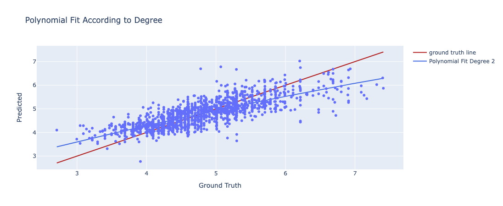

# Project Title

## Introduction
(add more)
This project aims to predict the renting prices in different cities using various features from the dataset, such as property type, room type, bed type, cancellation policy, city, cleaning fee, host profile picture availability, host identity verification, and instant bookability. Our goal is to understand how these features influence renting prices and to build a predictive model to assist renters and landlords alike.

## Method

### Data Exploration

1. The boxplot reveals the presence of outliers, makes the median a more reliable measure than the mean for imputing missing values.
   1. 

2. The histogram of the distribution of Airbnb price shows the data is a little left-skewed. 
   1. 

3. The correlation matrix is calculated below.
   1. 

***More investigations of other attributes can be found in the [Data PreProcessing Notebook](Data_preprocessing.ipynb), which are not shown due to the limit of space.***

### Data Preprocessing

1. Data Cleaning: 
   1. We drop columns with excessive unique categories or missing data that would be impractical to one-hot encode or impute, such as 'thumbnail_url', 'zipcode', 'neighbourhood', 'first_review', and 'last_review'.
   2. We convert the id column to a numeric type and rename it to 'id' for clarity and ease of reference.

2. Handling Missing Values: 
   1. A boxplot is drawn for the variables 'bathrooms', 'bedrooms', and 'beds' to visualize the distribution and identify outliers. Based on the presence of outliers, median values are chosen as a more reliable measure for imputing missing values. Missing values in 'bathrooms', 'bedrooms', and 'beds' are imputed with the median of each column, grouped by the 'accommodates' category, to maintain the integrity of the data.
   2. Missing values in 'host_response_rate' and 'review_scores_rating' are imputed with their respective median values. Before imputation, the 'host_response_rate' is converted from a percentage string to a float.
   3. We drop latitude and longitude column because it is difficult to process this kind of data and we already have City column.

3. Bag of Words (BOW) & Term Frequency-Inverse Document Frequency(TF-IDF)
   1. To utilize the 'description' and 'name' feature in training, we first need to transform each description into a vector and then discover the relationship between the descriptions and the log price. We use BOW and TF-IDF techniques, respectively, during the transformation process. We initially train the transformed vectors with the log price using a linear regression model, so that the model's theta learns the potential relationship between the description vector and the log price. We extract the theta of the LR model based on the words in each description. Then, we sum up the values of the corresponding theta and append the result as a new feature to our final training set.

4. Sentiment
   1.  It calculates the sentiment scores for the description and the name of a datapoint by summing up the sentiment scores of each word in the cleaned 'description' and 'name' respectively. If a word is not found in the sentiment_dict, its sentiment score is considered as 0.
         ```python
         punctuation = set(string.punctuation)

         def sentiment(d):
            sentimentScore = 0
            r = ''.join([c for c in d.lower() if not c in punctuation])
            for w in r.split():
               sentimentScore += sentiment_dict.get(w, 0)
            return sentimentScore
         def name(d):
            sentimentScore = 0
            r = ''.join([c for c in d.lower() if not c in punctuation])
            for w in r.split():
               sentimentScore += name_dict.get(w, 0)
            return sentimentScore
         ```

5. Fix perfect multicollinearity
   1. Perfect multicollinearity happens when one variable can be perfectly predicted from the others, causing issues in regression models by inflating the variance of the coefficient estimates, which can lead to a very large MSE. By setting drop_first=True, the function will drop the first level for each categorical variable. This effectively removes one dummy variable from each set of dummies derived from a categorical variable, thus eliminating the perfect multicollinearity that occurs when all dummy variables for a category are included.
      ```python
      df_encoded = pd.get_dummies(df, columns=['cleaning_fee','host_has_profile_pic', 'host_identity_verified', 'instant_bookable'], drop_first=True)
      ```

6. Encoding
   1. One-Hot Encoding:
      1. Categorical variables such as 'property_type', 'room_type', 'bed_type', 'cancellation_policy', 'city', 'cleaning_fee', 'host_has_profile_pic', 'host_identity_verified', and 'instant_bookable' were initially one-hot encoded. This process transforms categorical variables into a format that can be used in machine learning algorithms, creating separate binary columns for each category.
   2. KFold Target encoding:
      1. Due to the high dimensionality encountered with one-hot encoding, we implemented K-Fold target encoding to mitigate the issue. Target encoding is especially beneficial for neural network models. Where categorical features are replaced with the mean value of a target variable ('log_price') computed from each fold of the training data, to prevent data leakage.
   3. Leave One Out (LOO):
      1. Leave-One-Out (LOO) encoding is a form of target encoding that reduces overfitting by excluding the target value of the current row when calculating the category's mean target, thereby offering a more generalizable feature representation.
      <!-- 2. We tried LOO after target encoding, but obtained a MSE of 0.003 with our final model, which was dramastically lower than the prior MSE. We attemptted to find the reason that caused the reduction of the MSE but failed. Therefore, we decided not to ultilize this encoding technique until we find the reason. -->
   
7. Norm & Standard
   1. Both normalization and standardization have their own advantages, and we first consider to use min-max because it makes us easy to interpret the data. However, We finally choose to use standardization for our project because we consider that it is less sensitivec to those outliers compared with min-max normalization. After the exploration of the data, we find that there are some outliers in the dataset which may affect the result greatly if we do not use standardization.


### Model 1: 2nd degree Polynomial Regression
- We built our first model with 2nd degree Polynomial Regression.
- Second-degree polynomial regression extends linear regression by modeling the relationship between the independent variable $x$ and the dependent variable $y$ as a quadratic equation of the form $y = ax^2 + bx + c$. This allows for capturing non-linear relationships between the variables, making it suitable for datasets where the trend bends or curves, rather than following a straight line.
   ```python
   degree=2
   model = make_pipeline(PolynomialFeatures(degree), LinearRegression())
   model.fit(X_train, y_train)
   y_val_pred = model.predict(X_val)
   y_test_pred = model.predict(X_test)
   ```

### Model 2: Convolutional Neural Network (CNN)
- We build our second model with CNN, and train with hyperparameter tuner. 
   ```python
   def build_hp_model(hp):
      model = Sequential()
      # Iterate over the number of layers
      for i in range(hp.Int('num_layers', 2, 6)):
         model.add(Dense(units=hp.Int('units_' + str(i), min_value=16, max_value=96, step=16),
                           activation=hp.Choice('activation_' + str(i), ['leaky_relu'])))
      
      model.add(Dense(1))  # Output layer for regression
      learning_rate = hp.Float('learning_rate', min_value=1e-4, max_value=1e-2, sampling='LOG')
      
      model.compile(optimizer=keras.optimizers.legacy.Adam(learning_rate=learning_rate),
                     loss='mean_squared_error',
                     metrics=['mean_squared_error'])
      return model
   
   tuner = keras_tuner.RandomSearch(
    hypermodel=build_hp_model,
    objective='val_loss',
    max_trials=8,
    seed=10,
    executions_per_trial=3,
    directory='tuner_results',
    project_name='keras_tuner_demo',
    overwrite=True
   )
   ```
- Two Keras callbacks are utilized to enhance the training process:

  - Early Stopping: Monitors the validation loss and stops training if there hasn't been a significant decrease (less than 0.001) in the validation loss for 5 consecutive epochs. This prevents overfitting and ensures the model restores the weights from the epoch with the best performance.
      ```
      early_stopping = keras.callbacks.EarlyStopping(
         monitor='val_loss',
         min_delta=0.001,
         patience=5,
         mode='min',
         restore_best_weights=True,
      )
      ```

  - Model Checkpoint: Saves the model at the filepath 'checkpoints' whenever a lower validation loss is observed. This ensures that the model configuration with the best validation performance is preserved, even if the model's performance degrades in subsequent epochs.
      ```
      model_checkpoint = keras.callbacks.ModelCheckpoint(
         filepath='best_model.h5',
         monitor='val_loss',
         save_best_only=True,
         save_weights_only= False,
         mode='min'
      )
      ```
### Model 3: Extreme Gradient Boosting (XGBoost)
- We build our third model with XGBoost.
- This model employs the XGBoost framework to optimize a regression task, using a `GridSearchCV` to fine-tune hyperparameters over a specified grid. The key parameters include tree depth, learning rate, subsample rate, and feature sampling rate. The `XGBRegressor` is configured to minimize squared error with early stopping to prevent overfitting. The grid search explores combinations of these hyperparameters across a training dataset, evaluating performance through cross-validation to select the best model based on the negative mean squared error.
  
   ```python
   param_grid = {
   'max_depth': [3, 4, 5, 6, 7],
   'eta': [0.01, 0.05, 0.1, 0.2],
   'subsample': [0.6, 0.7, 0.8, 0.9],
   'colsample_bytree': [0.6, 0.7, 0.8, 0.9],
   }
   xgb_model = xgb.XGBRegressor(n_estimators=250, random_state=42,objective='reg:squarederror', eval_metric='rmse',early_stopping_rounds=10)

   grid_search = GridSearchCV(estimator=xgb_model, param_grid=param_grid, cv=5, scoring='neg_mean_squared_error', verbose=False, n_jobs=-1)

   grid_search.fit(X_train_full, y_train_full, eval_set=[(X_val, y_val)], verbose=False)
   ```


## Result
- The result is presented in 4 aspects for validation set and test set:
   - Mean Absolute Error (MAE)
   - Mean Squared Error (MSE)
   - Root Mean Squared Error (RMSE)
   - Coefficient of Determination (R2 Score)

1. 2nd Degree Polynomial Regression 
   - Validation Set Metrics:
      - MAE: 0.327352408724221
      - MSE: 0.19008515355141414
      - RMSE: 0.4359875612347377
      - R2 Score: 0.6258233461676486

   - Test Set Metrics:
      - MAE: 0.3302243929261407
      - MSE: 0.1950410023050807
      - RMSE: 0.4416344668445622
      - R2 Score: 0.6287113252143781
        

The figure displays a scatter plot of predicted versus ground truth values, used to evaluate the performance of a polynomial regression model. The x-axis, labeled "Ground Truth," represents the actual values of the data set, while the y-axis, labeled "Predicted," shows the values predicted by the model.

Two lines are plotted over the scatter points:
- The red line represents the ground truth line
- The blue line indicates the polynomial fit of degree 2

The scatter points represent individual predictions by the model, with their deviation from the ground truth line indicating the error in prediction. The closer the blue line fits to the red line, the better the model's predictions are. The degree of the polynomial fit, in this case, degree 2, suggests the model accounts for linear and squared terms in the relationship between the variables.

2. Neual Network
   - Validation Set Metrics:
      - MAE: 0.32539110961437845
      - MSE: 0.18865674426052614
      - RMSE: 0.4343463413688737
      - R2 Score: 0.6324616052246446

   - Test Set Metrics:
      - MAE: 0.33253964499504995
      - MSE: 0.19729123240638619
      - RMSE: 0.44417477686873014
      - R2 Score: 0.624427687710457
     

This figure represents the training process of the neural network ver epochs. The x-axis shows the epoch number, and the y-axis shows the loss, which is set to MSE. 
  There are three lines on the graph:
- The blue line represents the training loss, which decreases consistently, suggesting the model is learning well from the training data.
- The orange line shows the validation loss, which fluctuates as the model is tested against data it hasn't seen during training. 
- The dashed red line indicates the test loss, which is a measure of the model's performance on another set of unseen data. 
- The green dot marks the "Best Epoch", which is the point in training where the model achieved its best performance on the validation data.

3. XGboost
   - Validation Set Metrics:
      - MAE: 0.29035745141344005
      - MSE: 0.15093359400945044
      - RMSE: 0.38850172973804176
      - R2 Score: 0.705953311781413
   
   - Test Set Metrics:
      - MAE: 0.3147783376916175
      - MSE: 0.1803195301109762
      - RMSE: 0.4246404715885854
      - R2 Score: 0.6567357705219998

## Discussion
- In the discussion of our analytical approach, we started with the selection of a polynomial regression model, which was primarily driven by its lower mean squared error (MSE) compared to a linear model. This indicated a better fit to the data, aligning closely with the observed trends in our visualizations. However, we acknowledged that a more complex model isn't necessarily superior; it could be more prone to overfitting, especially if the polynomial degree was too high.

- We implemented k-fold cross-validation and neural network (NN) models to further refine our predictions and assess model stability across different data partitions. The inclusion of cross-validation was a critical step to guard against overfitting and to evaluate the model's ability to generalize to unseen data. With NN, we explored the utility of a more flexible, non-linear approach that could capture complex patterns in the data.

- Hyperparameter tuning was another vital step in the process, particularly for the NN model, where we ultimately selected the ReLU activation function. This decision was based on ReLU's performance and its widespread success in various applications, but we remained cautious about its well-known limitations, such as the dying ReLU problem.

- The final piece of our modeling puzzle was the XGBoost (XGB) algorithm, which brought an ensemble learning approach to the table. Its gradient boosting framework was expected to further enhance performance and has been celebrated for its effectiveness across numerous machine learning competitions.

- Throughout the process, we remained critical of our models, questioning their interpretability, especially with more complex architectures like NN and XGB. While the results were promising, we also recognized potential shortcomings, such as the reliance on the particularities of our dataset, which might not reflect broader patterns. There's always the possibility that a "donkey"—an unexpected variable or change in the data landscape—could challenge our model's reliability. Thus, despite achieving satisfactory results, we understand that our model is not the "unicorn" of solutions, and we must be prepared for future adaptations and refinements as new data comes to light.
 
## Conclusion

## Collaboration
