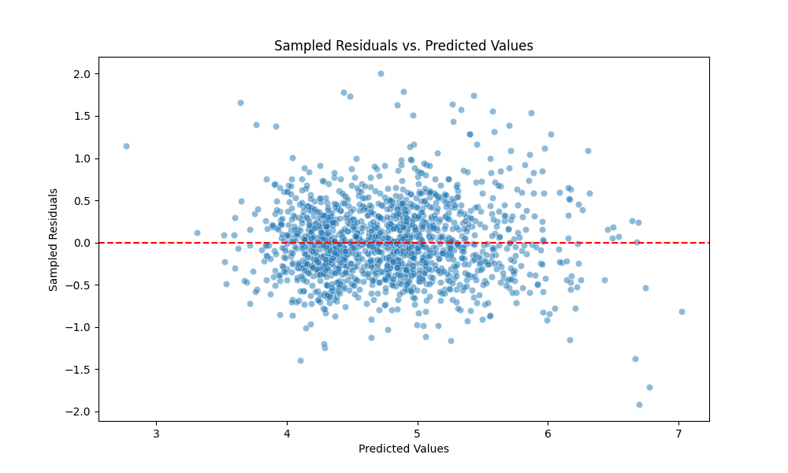
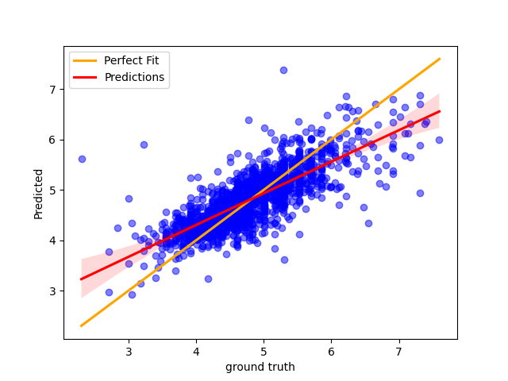

# 151A-project

## [Milestone 2](Milestone2.ipynb)

### About the Data Set
This project aims to predict the renting prices in different cities using various features from the dataset, such as property type, room type, bed type, cancellation policy, city, cleaning fee, host profile picture availability, host identity verification, and instant bookability. Our goal is to understand how these features influence renting prices and to build a predictive model to assist renters and landlords alike.

### Dataset Description

The dataset comprises listings with features that describe the property, host, and booking policies. Here are some key details:

Number of Instances (records in the data set): __74111__

Number of Attributes (fields within each record, including the class): __29__

Target Variable: The target variable is the renting price(log_price), which we aim to predict.

### Data Cleaning and Preprocessing Overview

In this analysis, we perform several steps to clean and preprocess the Airbnb dataset to prepare it for further analysis and modeling. The process involves handling missing values, encoding categorical variables, and ensuring data integrity. Below are the detailed steps undertaken:

1. Data Importation: The dataset originally in CSV format, is compressed into a .tar.gz file. This step is crucial for efficient file storage and management, enabling us to upload the dataset to GitHub without encountering issues related to file size limitations. 
2. Initial Data Exploration: We checked the shape of the dataset to get an idea of its size and remove the last row to clean up the data, ensuring that only relevant records are analyzed.
3. Data Cleaning: 
   1. We drop columns with excessive unique categories or missing data that would be impractical to one-hot encode or impute, such as 'thumbnail_url', 'zipcode', 'neighbourhood', 'first_review', and 'last_review'.
   2. We convert the id column to a numeric type and rename it to 'id' for clarity and ease of reference.
4. One-Hot Encoding: Categorical variables such as 'property_type', 'room_type', 'bed_type', 'cancellation_policy', 'city', 'cleaning_fee', 'host_has_profile_pic', 'host_identity_verified', and 'instant_bookable' are one-hot encoded. This process transforms these categorical variables into a format that can be used in machine learning algorithms, creating separate binary columns for each category.
5. Handling Missing Values: 
   1. A boxplot is drawn for the variables 'bathrooms', 'bedrooms', and 'beds' to visualize the distribution and identify outliers. Based on the presence of outliers, median values are chosen as a more reliable measure for imputing missing values. Missing values in 'bathrooms', 'bedrooms', and 'beds' are imputed with the median of each column, grouped by the 'accommodates' category, to maintain the integrity of the data.
   2. Missing values in 'host_response_rate' and 'review_scores_rating' are imputed with their respective median values. Before imputation, the 'host_response_rate' is converted from a percentage string to a float.
   3. We drop latitude and longitude column because it is difficult to process this kind of data and we already have City column.

### Plots and Visualizations
In this analysis, heatmap, pairplot, and box plots were used to visualize the data. Based on the visualized data, we will need to do data preprocessing on following collomns:
1. Creating a boxplot for the distribution of bathrooms, bedrooms, and beds to identify outliers.

2. Plotting histograms for host_response_rate and review_scores_rating to observe their distributions and filling missing values with the median.

3. Generating a histogram for log_price to visualize the price distribution.

4. Computing and visualizing a correlation matrix and heatmap for selected numeric features to understand relationships between variables.

5. Creating a pairplot for the same subset of numeric features to visualize distributions and pairwise relationships.

6. For These 9 price and type plot,while log-transformed prices are valuable for analysis and modeling, presenting findings in log scale can be less intuitive for a general audience.Most people are not accustomed to thinking in terms of logarithmic scales in their daily lives.   Therefore, converting the log prices back to actual prices before presenting the results is often necessary. Actual prices give a direct, real-world interpretation of the costs involved.
 
### Data Preprocessing
To prepare the data for modeling, we performed the following preprocessing steps:

1. Min-Max Normalization: Applied to numerical features to bring them to a scale between 0 and 1, improving model performance and stability.

2. From the heatmap, number_of_reviews has a very low correlation with log_price (-0.01), suggesting that it has almost no linear relationship with the log of the price. Similarly, review_scores_rating also has a very low correlation with log_price (0.09), indicating a very weak linear relationship. So we might consider dropping number_of_reviews and review_scores_rating based on their low correlations with log_price. 

3. We might also use Bag of Words (BoW) or Term Frequency-Inverse Document Frequency (TF-IDF) methods to process the 'description' column.

4. Based on the bar chart, it appears that 'host_identity_verified' and 'instant_bookable' may have a minimal impact on pricing. So we might also consider dropping these 2 column.

5. Standardization is needed since accommodates, bathrooms, number_of_reviews, review_scores_rating, bedrooms, and beds are skewed. This would ensure that they all contribute equally to the analysis and that the model's performance is not inadvertently influenced by the natural variance in the dataset.

## [Milestone 3](Milestone3.ipynb)

### More data preprocessing

1. norm & standard
Both of them have their own advantages, and we first consider to use min-max because it makes us easy to interpret the data. However, We finally choose to use standardization for our project because we consider that it is less sensitivec to those outliers compared with min-max normalization. After the exploration of the data, we find that there are some outliers in the dataset which may affect the result greatly if we do not use standardization.

2. BoW & TF-IDF:
To utilize the 'description' and 'name' feature in training, we first need to transform each description into a vector and then discover the relationship between the descriptions and the log price. We use Bag of Words (BOW) and TF-IDF techniques, respectively, during the transformation process. We initially train the transformed vectors with the log price using a linear regression (LR) model, so that the model's theta learns the potential relationship between the description vector and the log price. We extract the theta of the LR model based on the words in each description. Then, we sum up the values of the corresponding theta and append the result as a new feature to our final training set.

3. Sentiment: It calculates the sentiment score of a description by summing up the sentiment scores of each word in the cleaned 'description' and 'name'. If a word is not found in the sentiment_dict, its sentiment score is considered as 0.

4. Fix perfect multicollinearity: Perfect multicollinearity happens when one variable can be perfectly predicted from the others, causing issues in regression models by inflating the variance of the coefficient estimates, which can lead to a very large MSE. By setting drop_first=True, the function will drop the first level for each categorical variable. This effectively removes one dummy variable from each set of dummies derived from a categorical variable, thus eliminating the perfect multicollinearity that occurs when all dummy variables for a category are included.

### Plots and Visualizations

Visual analysis aimed to gain insights into the model and guide the improving steps. The following visualizations were created:

1. **Sampled Residuals vs. Predicted Values Plot:** This scatter plot showcases the residuals of our predictions versus the actual values. A horizontal dashed line at 0 represents a perfect prediction. Most residuals cluster around this line within a reasonable range, although there is some noticeable spread, indicating variability in the prediction error.

1. **Prediction line Plot:** The second visualization presents a scatter plot comparing ground truth values with our predictions. The solid red line represents a perfect fit alongside our prediction trend. The line of best fit is plotted through the predictions to illustrate the correlation. The closer the blue points and the trend line are to the perfect fit line, the more accurate our predictions.

### Next Two Models

1.   XGBoost (Extreme Gradient Boosting):
XGBoost is a powerful and popular machine learning algorithm known for its performance in structured/tabular data and its ability to handle complex relationships within the data:

- XGBoost is robust to overfitting and can handle a large number of features, making it suitable for this dataset with 29 attributes.
- It can capture non-linear relationships between features and the target variable, which might not be effectively captured by linear or polynomial regression models.
- XGBoost often performs well in competitions and real-world applications, making it a reliable choice for predictive modeling tasks.
- It provides feature importance scores, which can help in understanding the relative importance of different features in predicting renting prices.

2.   Neural Networks (NN):
Neural networks, particularly deep learning architectures,which can learn complex patterns from data:

- Neural networks can capture intricate patterns and relationships in the data, potentially outperforming traditional models like regression or tree-based methods.
- They are capable of automatically learning feature representations from the data, eliminating the need for manual feature engineering.
- With advancements in hardware and software frameworks (e.g., TensorFlow, PyTorch), training neural networks has become more accessible and efficient.
- Architectures like feedforward neural networks, convolutional neural networks (CNNs), or recurrent neural networks (RNNs) can be explored based on the nature of the data and the problem at hand.

Both XGBoost and neural networks offer flexibility and scalability, allowing for experimentation with different architectures, hyperparameters, and feature engineering techniques to improve predictive performance.   Additionally, ensemble methods like stacking or blending could also be considered to combine the strengths of multiple models and potentially achieve better results.

### Conclusion

1. First model: 2nd degree Polynomial Regression
   
   We built our models using 2nd degree Polynomial Regression. 

   The second-degree polynomial regression model yields a Mean Squared Error (MSE) of approximately  0.1868, indicating a moderate level of error in prediction. Additionally, the model achieves a relatively high R2 score of approximately 0.6444, indicating that around 64.44% of the variance in the dependent variable is explained by the independent variables. This suggests that the second-degree polynomial regression model provides a reasonable fit to the data, explaining a significant portion of the variability in the dependent variable. However, the moderate MSE indicates that there is still room for improvement in prediction accuracy. 
   
   To potentially improve the performance of our regression model, several strategies can be considered:

      1. Cross-validation: Consider techniques like k-fold cross-validation or leave-one-out cross-validation.
   
      2. Observe the dataset: Explore additional features or transformations of existing features that might better capture the underlying relationships in the data.
   
      3. Outlier Detection and Removal: Identify and remove outliers or influential data points that might disproportionately affect the model's performance. 
